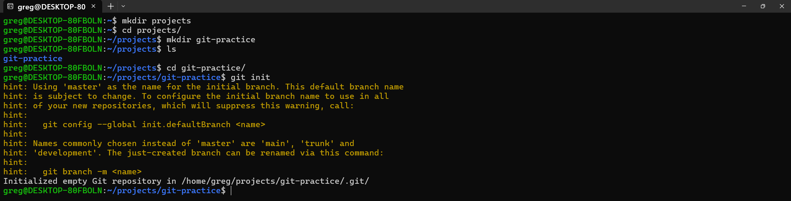
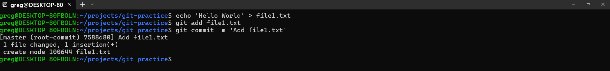
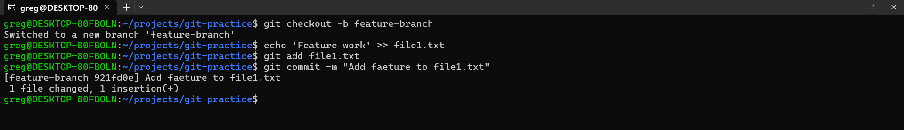
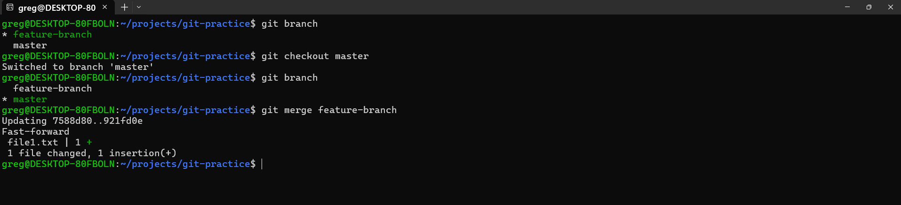

# Git Practice Labs

## Overview
This project demonstrates hands-on Git skills including repository initialization, committing changes, branching, merging, and preparing for pull requests.  
All steps were performed manually in the terminal to simulate real-world Git workflows.

---

## Step 1: Create Project Directory and Initialize Git Repository
Create a new project folder and initialize a Git repository.

mkdir ~/projects/git-practice
cd ~/projects/git-practice
git init

## Step 2:Create First File and Commit

Create a text file, stage it, and make the first commit.

echo "Hello World" > file1.txt
git add file1.txt
git commit -m "Add file1.txt"

## Step 3: Create a Feature Branch and Modify File

Create a new branch and add feature content to the file.

echo "Hello World" > file1.txt
git add file1.txt
git commit -m "Add file1.txt"

## Step 4: Merge Feature Branch into Main

Switch back to the main branch and merge changes.

git checkout master
git merge feature-branch

## Step 6: Add Remote Repository and Push to GitHub

Connect the local repository to GitHub and push changes

git remote add origin https://github.com/gregodprogrammer/git-practice.git
git add README.md file1.txt
git commit -m "Project 2: Git practice labs"
git push -u origin main

